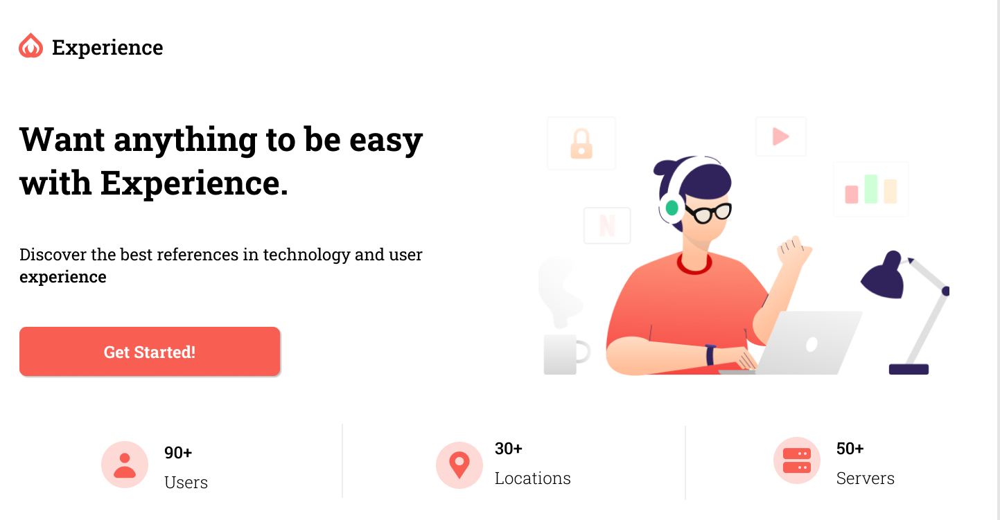

  

# :rocket: Technologies

## Front-end

- [ReactJS](https://reactjs.org/)
- [styled-components](https://www.styled-components.com/)
- [react-reveal](https://www.react-reveal.com/)
- [polished](https://polished.js.org)

## Back-end

- [Express](https://expressjs.com/pt-br/)
- [Paypal Rest SDK](https://developer.paypal.com/docs/api/rest-sdks/)
- [Yup](https://github.com/jquense/yup)

# Design :art:

https://www.figma.com/community/file/1024102052690050665/Experience

# User account to use in Sandbox :credit_card: :

    Email: comprador@node.com
    Senha: 12345678

# :memo: License

This project is under the MIT license. See the [LICENSE](https://github.com/lucianobajr/node-paypal/blob/master/LICENSE) for more information.
